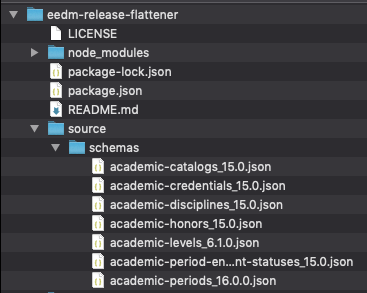
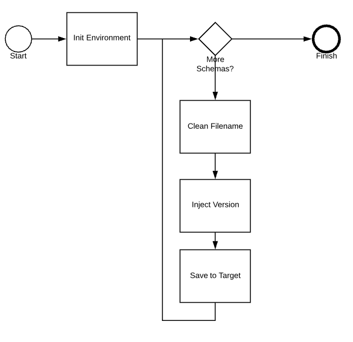

# Ethos Data Model Release Flattener

Utility for flattening and reshape/cleanse an Ellucian Ethos Data Model Release.

This can be used to help review the schemas in external tools.

## Current Features

This application takes the "latest" schema download and scrubs the filenames.

It currently assumes all the files with names like:

 - academic-catalogs_15.0.json
 - academic-credentials_15.0.json

It will produce a target directory with file names like:

 - academic-catalogs.json
 - academic-credentials.json

## Future

- Apply a filter to remove schemas we are not using or have installed

## Setup and Requirements

Clone or pull down this repo containing the source files.  

This application is a Node/JavaScript application that was developed using npm 6.

## Configure

The input source to this application is a collection of EEDM schemas. 

Right now this specially is the zip file of the latest schemas that is downloadable from the Ellucian Ethos Resources Site.

This assumes the zip has been downloaded and unzipped into a source directory that is reachable by this app.

By default it expects the schemas to be in a \source\schemas directory. This can be overwritten by using the following environment variables.

 - INPUT_DIRECTORY
 - FLAT_SCHEMAS_INPUT_DIRECTORY

A sample configuration could be having the INPUT_DIRECTORY be {source} and the FLAT_SCHEMAS_INPUT_DIRECTORY be {schemas}.  Therefore the application would expect a .\source\schemas directory with all the schemas in it.



Since including the version in the schema's is a new pattern, not all the schemas have it.  By default this application will inject the version number as it cleans and flattens. If you do not with to do that you can set a env INJECT_VERSION = false;

## Initialize

The first time you grab the source code:

```bash
$ npm config set registry https://registry.npmjs.org/
$ npm update
```

## Running

Once you have everything configured, you can run:

```bash
$ npm start
```

## Unit tests

To run the unit tests:

```bash
$ npm test
```

## Application Flow

